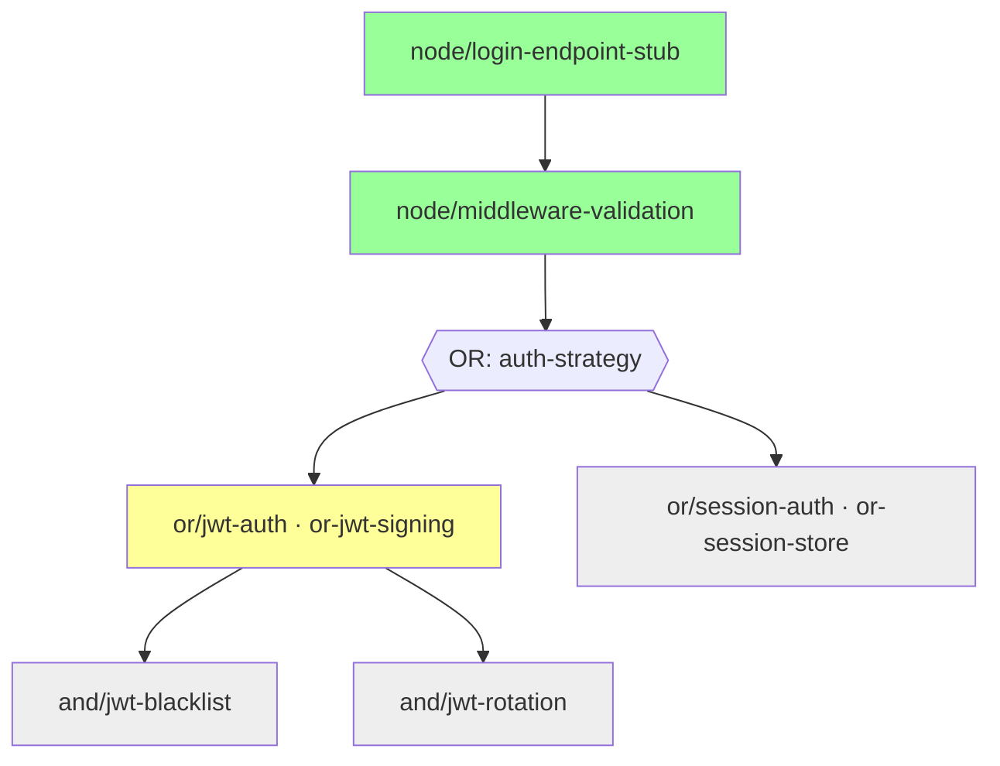

# PLAN（模板 / 示例）

> **视图层**。计划的 source of truth 是 `.auto-dev/dag.json`。本文件由 dag.json 渲染而来（或与之保持一致），**所有 workflow 判定读 dag.json，不读 PLAN.md**。两者冲突时以 dag.json 为准。

人类在此做两件事：① 视觉扫读 DAG 形状；② review 节点规范的自然语言描述。修改决策（加节点、改边类型、调 scope）先改 dag.json 跑校验，再同步本文件。

---

## DAG

> common successor（login-endpoint-stub, middleware-validation）落在 `ai-main`。OR 从 `middleware-validation` 的 tag 分出，OR 之间不会合并——由人类决策后只有一条留下；最终 `ai-main` → `main` 的 PR 由人类发起，AI 不碰 `main`。

---

## 节点表（从 dag.json 渲染）

| id | kind | 入边 (type, from) | branch | status | completion tag |
|----|------|------------------|--------|--------|----------------|
| login-endpoint-stub | COMMON | —（root） | ai-main | done | `node/login-endpoint-stub` |
| middleware-validation | COMMON | SEQ ← login-endpoint-stub | ai-main | done | `node/middleware-validation` |
| or-jwt-signing | OR_HEAD | OR ← middleware-validation（or_group=auth-strategy） | or/jwt-auth | dev | — |
| or-session-store | OR_HEAD | OR ← middleware-validation（or_group=auth-strategy） | or/session-auth | pending | — |
| and-jwt-blacklist | AND | AND ← or-jwt-signing（and_group=jwt-extensions） | and/jwt-blacklist | pending | — |
| and-jwt-rotation | AND | AND ← or-jwt-signing（and_group=jwt-extensions） | and/jwt-rotation | pending | — |

**status 取值**：`pending` / `dev` / `done` / `blocked` / `pending-review` / `abandoned` / `decided`（见 schema）。

---

## 边审计（dag.json.edges）

每条边必须有 `rationale`。扫读用：

| from → to | type | group | rationale |
|-----------|------|-------|-----------|
| login-endpoint-stub → middleware-validation | SEQ | — | MW reads the route registered by the stub; must exist first |
| middleware-validation → or-jwt-signing | OR | auth-strategy | JWT candidate; mutually exclusive with session |
| middleware-validation → or-session-store | OR | auth-strategy | Session candidate; mutually exclusive with JWT |
| or-jwt-signing → and-jwt-blacklist | AND | jwt-extensions | Blacklist and rotation share jwt-signing contract; no inter-dep |
| or-jwt-signing → and-jwt-rotation | AND | jwt-extensions | Rotation is independent of blacklist; both consume signToken only |

---

## 节点规范（从 dag.json.nodes[] 渲染）

每个节点按 `templates/NODE.md` 的模板展示。字段 entry / completion / scope / retry_limit / escalation 必须与 dag.json 完全一致。示例：

### Node: or-jwt-signing

**Entry assumptions**（dag.json: nodes[].entry）
- [x] `node/middleware-validation` 已存在
- [x] MW 提供 `req.auth: { token?: string }`

**Completion condition**（dag.json: nodes[].completion）
- [ ] `signToken(payload, ttl) → string` + `verifyToken(string) → payload | null` 对外暴露
- [ ] `tests/jwt/sign.test.ts` 全绿

**Scope limit**（dag.json: nodes[].scope）
- max_files_changed: 4
- max_new_dependencies: 1（jose）
- estimated_commits: 2–3

**Retry limit** — 3（dag.json: nodes[].retry_limit）

**Failure escalation**（dag.json: nodes[].escalation）
- l1_trigger: MW 接口不够（比如缺 token 提取位置）
- l2_trigger: 测试表明 JWT 无法满足需求（例如需要即时吊销但黑名单被排除）

---

## OR 候选对照（dag.json.or_groups[]）

| or_group | question | or_type | candidates | decided |
|----------|----------|---------|------------|---------|
| auth-strategy | JWT vs session-backed auth | A | or-jwt-signing, or-session-store | — |

用户处理完 inquiry/spike 后在 dag.json `or_groups[].decided` 字段写入获胜候选 id；主循环据此打 `decision/selected-*` / `decision/rejected-*` tag。

---

## 维护规则

1. **先改 dag.json，再同步本视图**。倒过来不行：本视图的自由文本字段不是 source of truth。
2. 每次改完 dag.json 跑 `python3 scripts/validate_dag.py .auto-dev/dag.json`，退出码 0 才能提交。
3. 节点完成时更新 dag.json 里的 `status` / `completion_tag`，然后再来更新本表。
